## Varsity Enrollment Log System

- This project is developed by using Django Framework, D3.js, Ajax, Html, CSS, Material
CSS and Javascript.
- The main purpose of this project is to get acquainted with a new framework and to
implement the framework.
- The project was given to us to get a taste of how a software firm develops a project. And
with great team work the project was completed in due time.

You can view the project live <a href="http://moumitasen.pythonanywhere.com/">here</a>.
- Username: shafiq
- Password: 1234!@#$

## Overview
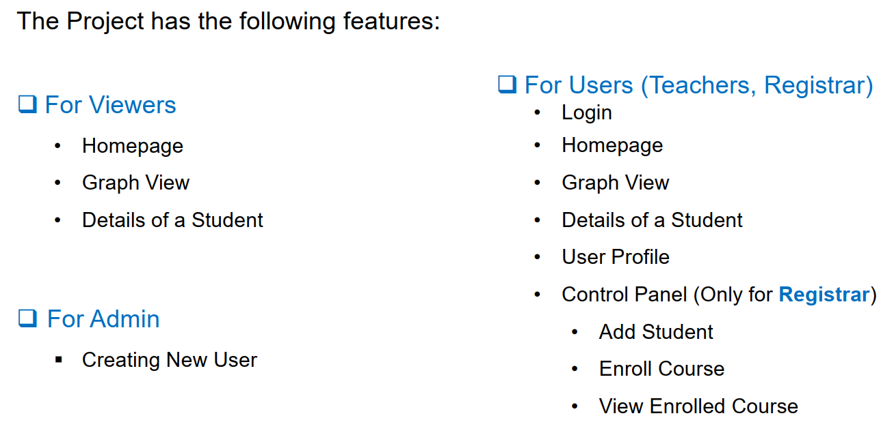

### Homepage: 
It contains information about the project in short. The Viewers as well as the users can view the Homepage.

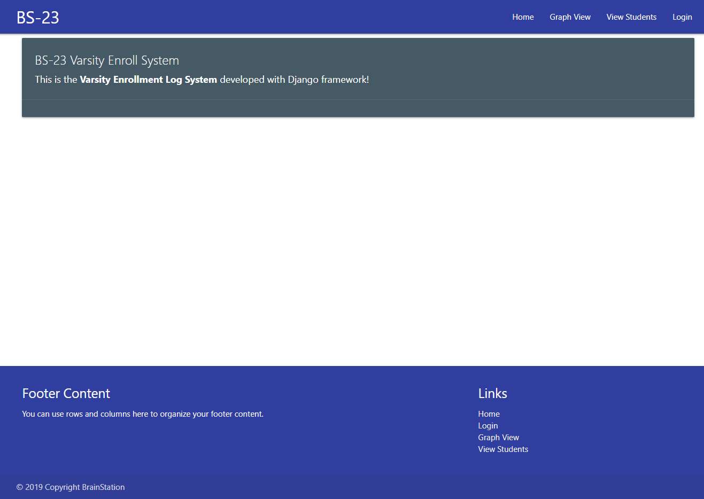

### Login : 
The Teachers and Registrar can login as users
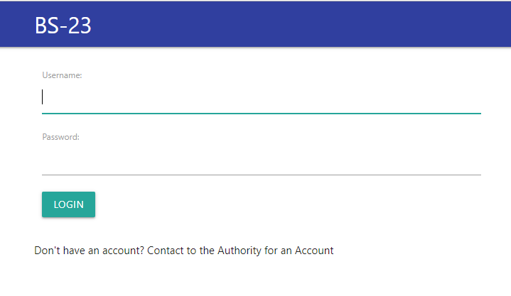
### Graph View : 
It gives the visualization of students under a specific Batch (i.e. 2015) which is
under a Session (i.e. 2019) which is also under a specific Teacher of a specific Department.
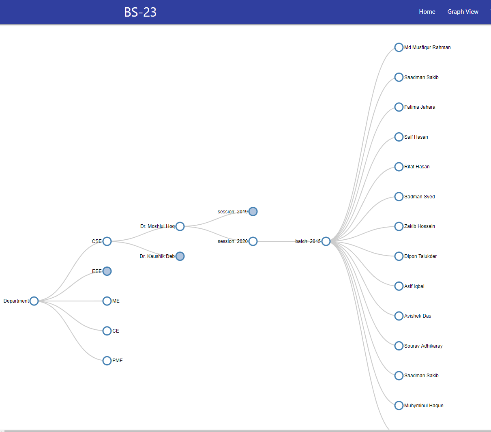

### Student Details : 
The Details of a student is also shown by submitting a student id (i.e. 1501001).
Viewers and users can view the same information except The viewers cannot see the birth date of a
student.

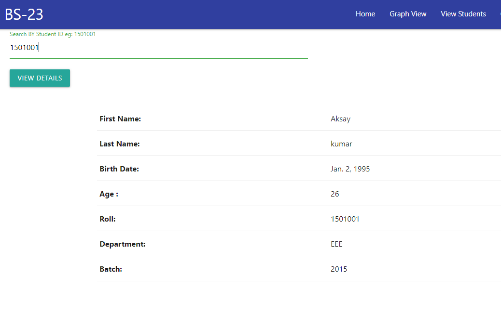

### Control Panel : 
Only the Registrar can Add Student, Enroll Course to a Course Co-ordinator and
Check the Status of the current Course Co-ordinator.
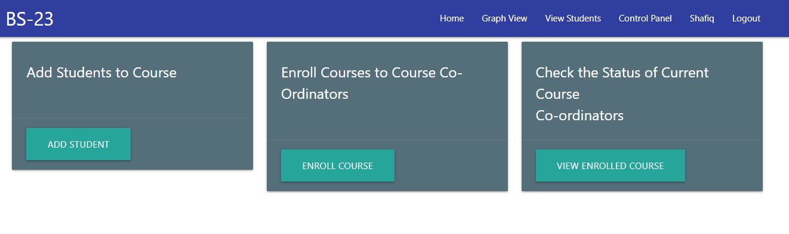

### Control Panel -> Add student: 
The Registrar can add a student by inserting his/her name, birth
date, roll number, department and batch

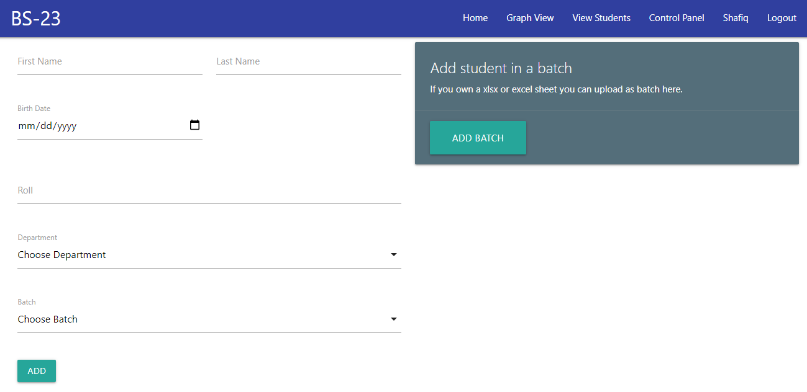

### Control Panel -> Enroll Course: 
The Registrar can also add a batch under a Course Co-ordinator
of a Department

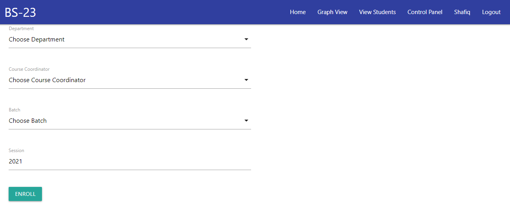

### Control Panel -> View Enrolled Course : 
The Registrar can also view students under a specific
Batch (i.e. 2017) which is under a Session (i.e. 2019) which is also under a specific Course Coordinator of a specific Department.
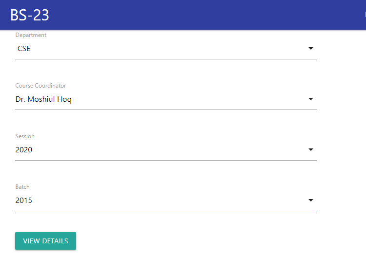

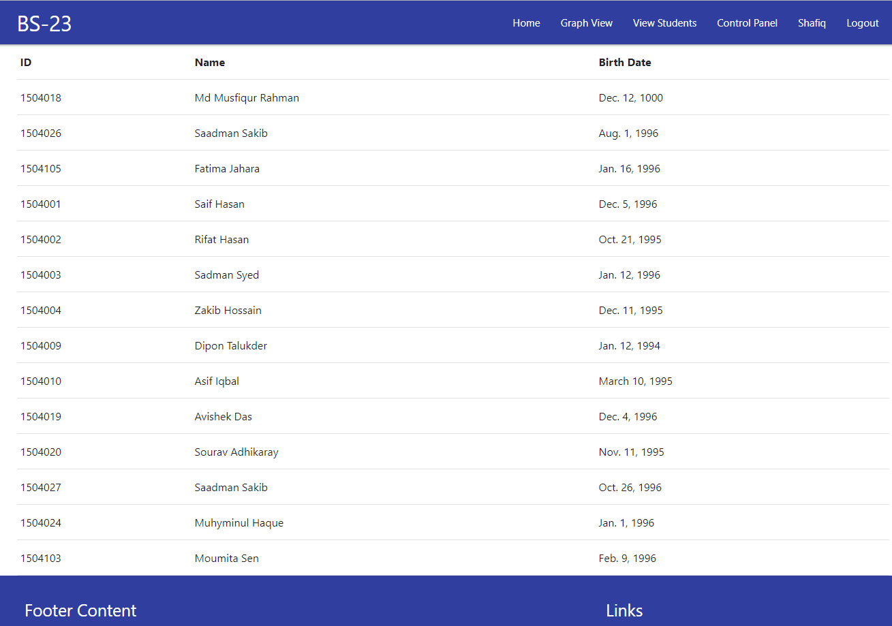

### User Profile : 
Both the Teachers and Registrar can view their personal information.
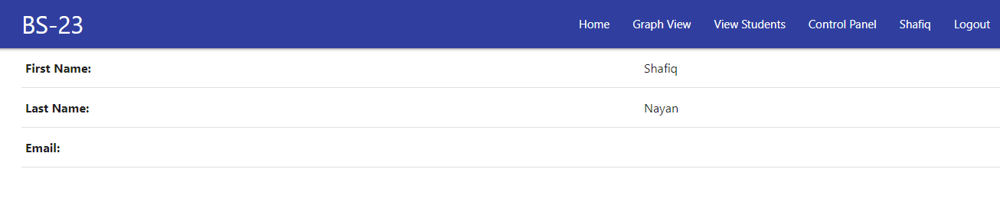

